<div align="center">


<h1>Arachnel</h1>

<p>
  <a href="README.md"></a>
  <a href="README.ru.md"></a>
</p>

<p>
  <a href="https://hosted.weblate.org/engage/arachnel/">
    
  </a>
</p>

<br>



</div>

<br>

## About

**Arachnel** is a desktop game launcher inspired by Hydra, built around **plugin-based sources** instead of one universal install pipeline.

Each source (FreeTP, Online-Fix, …) can define its own catalog, download, install, and launch flow — portable archives, installers, bundled fixes, or separate patches.

**Already in place**

- Material 3 UI: library, multi-source catalog, downloads, game details, settings
- Torrent downloads via libtorrent (magnet links from catalog JSON)
- Persistent settings, library, and download jobs
- Cover art and descriptions via Steam API
- Community translations on [Weblate](https://hosted.weblate.org/projects/arachnel/)

**Docs:** [Vision](docs/VISION.md) · [Architecture](docs/ARCHITECTURE.md) · [Roadmap](docs/ROADMAP.md) · [Translating](docs/TRANSLATING.md)

## Quick start

```bash
# Linux
./run.sh

# Windows
.\run.ps1
```

Manual build, dependencies, and environment variables are documented in the repo scripts and `cmake/`.

## Contact

**kirill.kif234@gmail.com** — only for important matters.

Everything else (bugs, ideas, questions): please use [GitHub Issues](https://github.com/BadKiko/Arachnel/issues).
