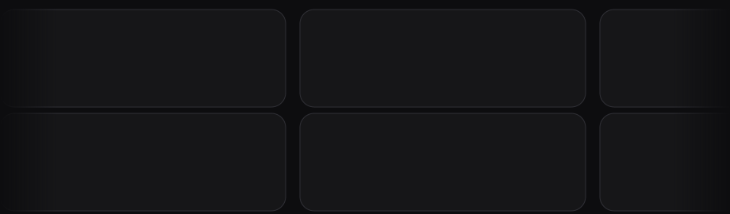

<h1>Arachnel</h1>

  
  

  

 

 

Game launcher for Windows and Linux.

The whole point is plug and play. Pick a game, download it, hit Play. On Windows it just runs. On Linux it grabs what it needs (Proton and that kind of stuff) so you don't have to mess with the OS.

Builds: [Releases](https://github.com/BadKiko/Arachnel/releases)

Bugs/ideas: [Issues](https://github.com/BadKiko/Arachnel/issues)
