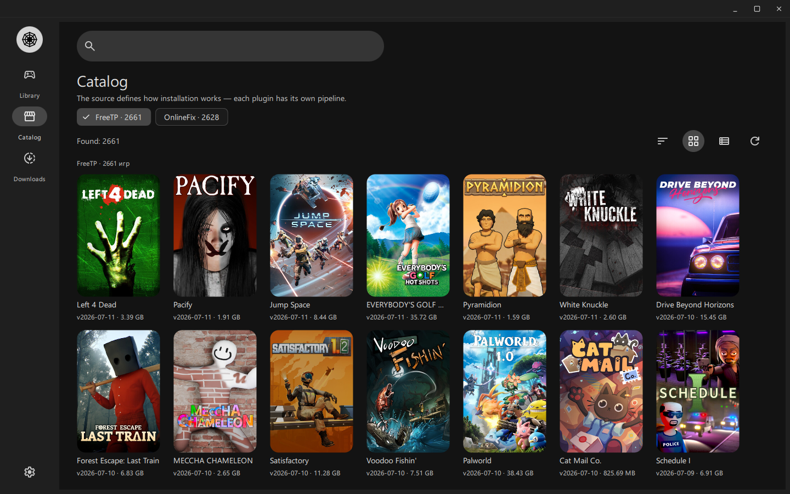
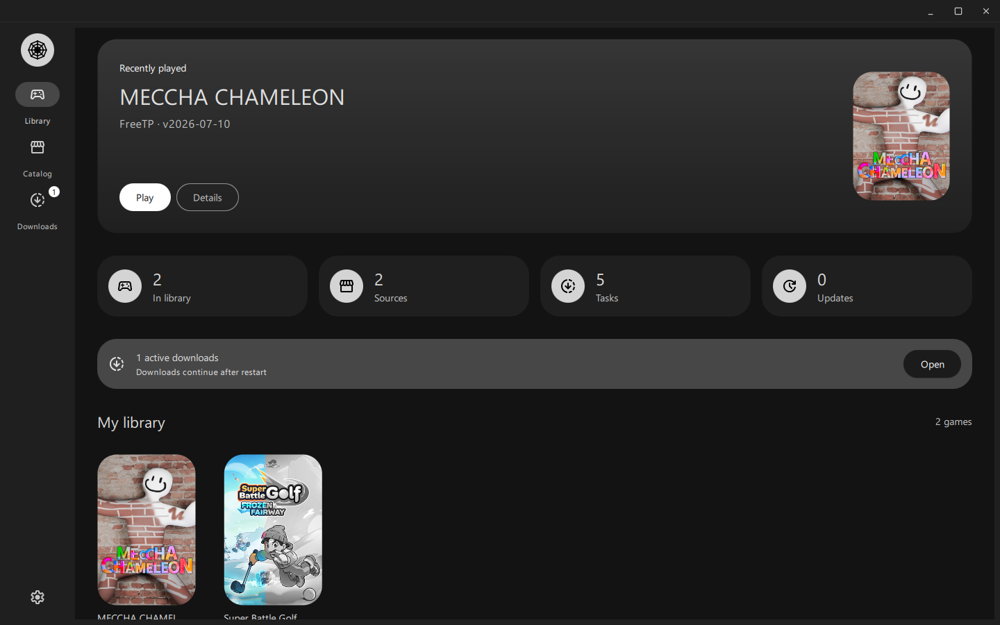
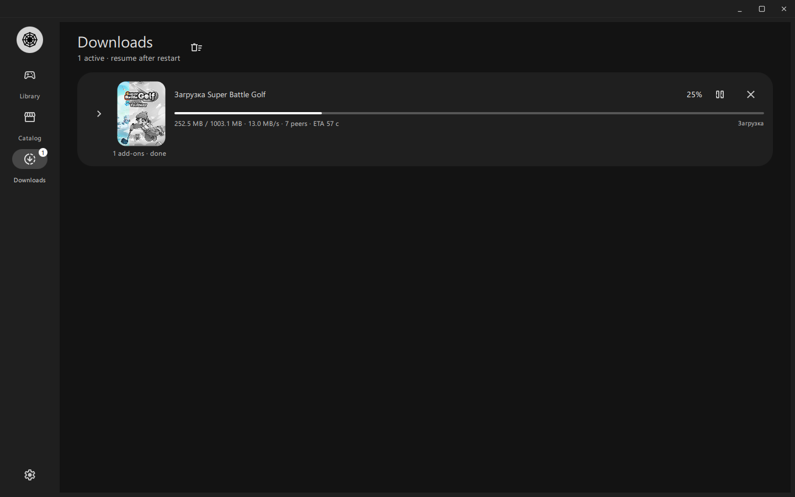

<div align="center">


<h1>Arachnel</h1>

<p>
  <a href="README.md"></a>
  <a href="README.ru.md"></a>
</p>

<p>
  <a href="https://hosted.weblate.org/engage/arachnel/">
    
  </a>
</p>

<br>


</div>

<br>


## Что это?

Arachnel — лаунчер на Material 3: каталоги, торрент-загрузка, установка через **плагины источников** и запуск из одной библиотеки.

По набору функций ближайший open-source аналог — **[Hydra Launcher](https://github.com/hydralauncher/hydra)**: отличный софт, выбирайте что удобнее. Arachnel идёт другим путём внутри: каждый источник — свой плагин (portable, installer, фикс в сборке или отдельный патч), а нативный Qt обычно легче по памяти.

| | [Hydra](https://github.com/hydralauncher/hydra) | Arachnel |
|---|--------|----------|
| Источники | Общая модель загрузки / установки | **Плагин на каждый источник** |
| Установка | В основном один пайплайн | Portable / installer / fix — решает плагин |
| Каталоги | Встроенные + community-фиды | Плагины **и** URL `games.json`, совместимые с Hydra |
| Стек | Electron | Нативный Qt / QML |
| RAM (Windows, в простое) | ~700&nbsp;МБ | ~200&nbsp;МБ |

## Что уже работает

### Для игрока

- **Библиотека** — установленные игры, «сейчас играю», бейджи обновлений, удаление / перенос между дисками
- **Каталог** — чипы источников, поиск, сортировка, сетка/список, обложки и описания Steam (кэш на диске)
- **Загрузки** — magnet через libtorrent: прогресс, скорость, пиры, ETA; пауза / продолжить / отмена; HTTP-аддоны, если так указано в фиде
- **Установка и запуск** — с плагином источника (например FreeTP): скачать → автоустановка → **Играть**; выбор DLC/аддонов перед установкой
- **Обновления игр** — сравнение с каталогом; проверка / установка; опционально автообновление при запуске
- **Обновления лаунчера** — проверка GitHub Releases в настройках (скачать Setup.exe / AppImage из приложения)
- **Хранилище** — несколько папок/дисков библиотек; выбор куда ставить; отдельная папка загрузок
- **Оформление** — тёмная/светлая тема, акценты; интерфейс **EN / RU** ([Weblate](https://hosted.weblate.org/projects/arachnel/))
- **Linux** — скачивание и выбор Proton-GE в Настройки → Запуск; Windows-сборки идут через Proton
- **Windows** — свой title bar; установщик Setup из [Releases](https://github.com/BadKiko/Arachnel/releases)

### Источники (важно)

| Режим | Что получаете |
|------|----------------|
| **Плагин источника** (`.arach`) | Полный цикл: каталог → загрузка → **установка** → **Играть** |
| **Каталог Hydra** (только JSON URL) | Просмотр + торрент, дальше **ручная установка** — как в Hydra один в один (открыть папку / запустить installer / указать путь к игре) |

Сейчас готов плагин **FreeTP** ([arachnel-plugin-freetp](https://github.com/PetWork/arachnel-plugin-freetp)) — автоустановка и «Играть». Online-Fix как плагин ещё не готов; JSON-фиды в **Настройки → Каталоги Hydra** работают с ручной установкой, как в Hydra.

## Быстрый старт (пользователь)

1. Скачайте сборку с **[Releases](https://github.com/BadKiko/Arachnel/releases)**:
   - Windows: `Arachnel-<version>-Setup.exe`
   - Linux: `Arachnel-<version>-x86_64.AppImage`
2. Установите плагин **FreeTP**: возьмите `freetp.arach` из [репозитория плагина](https://github.com/PetWork/arachnel-plugin-freetp), затем в Arachnel: **Настройки → Плагины → Установить .arach…**
3. На Linux откройте **Настройки → Запуск** и установите Proton-GE, если приложение попросит.
4. **Каталог** → выберите игру → Установить → дождитесь Загрузок → **Играть** из Библиотеки.

Дополнительно: URL `games.json`, совместимые с Hydra — **Настройки → Каталоги Hydra**.

<details>
<summary>Сборка из исходников</summary>

```bash
# Linux
./run.sh

# Windows
.\run.ps1
```

Нужны Qt 6.8+, CMake 3.20+, C++20 и libtorrent (системный пакет или FetchContent в CMake).  
AppImage: `scripts/ci/package-appimage.sh` — см. [docs/RELEASE.md](docs/RELEASE.md).

</details>

## Экраны

| Каталог | Библиотека | Загрузки |
|:---:|:---:|:---:|
|  |  |  |

## Дальше по плану

- Online-Fix как полноценный плагин источника
- Популярные плагины внутри официальных релизов
- Доработки UX (центр уведомлений, проверка целостности portable)

Roadmap для контрибьюторов: [docs/ROADMAP.md](docs/ROADMAP.md)

## Документация и плагины

| Документ | Для кого |
|----------|----------|
| [VISION.md](docs/VISION.md) | Зачем проект |
| [ARCHITECTURE.md](docs/ARCHITECTURE.md) | Слои и контракт плагина |
| [PLUGIN_SDK.md](docs/PLUGIN_SDK.md) | Как писать плагин источника |
| [CATALOG_FORMAT.md](docs/CATALOG_FORMAT.md) | Формат JSON-фида |
| [TRANSLATING.md](docs/TRANSLATING.md) | i18n / Weblate |
| [RELEASE.md](docs/RELEASE.md) | Релизы через GitHub Actions |
| [plugins/README.md](plugins/README.md) | Статус плагинов и цикл FreeTP |

Плагины живут в **отдельных репозиториях**. Здесь — только хост и SDK.

## Связь

**kirill.kif234@gmail.com** — только по важным вопросам.

Баги, идеи, вопросы: [GitHub Issues](https://github.com/BadKiko/Arachnel/issues).
