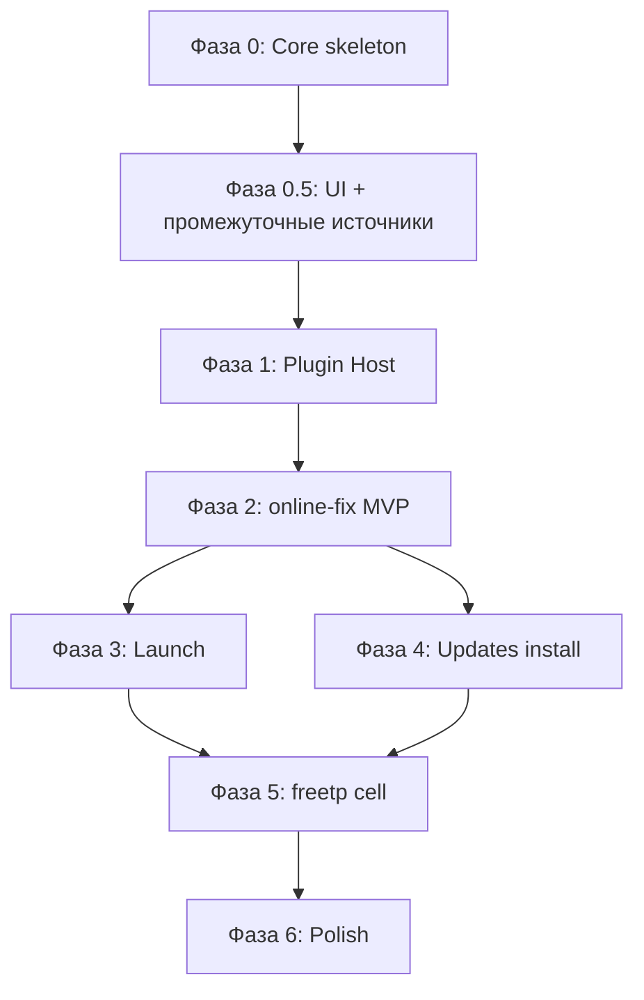

# Arachnel — карта движения (roadmap)

Документ для разработчиков и **будущих AI-агентов**: что уже есть, куда идём, что делать дальше.

Связанные документы:

- [VISION.md](VISION.md) — зачем проект
- [ARCHITECTURE.md](ARCHITECTURE.md) — слои и контракт плагина
- [CATALOG_FORMAT.md](CATALOG_FORMAT.md) — JSON-фид каталога
- [plugins/README.md](../plugins/README.md) — каталог плагинов

---

## Прогресс (обновлено 2026-07-11)

### Сделано

| Компонент | Статус |
|-----------|--------|
| **Фаза 0** — скелет ядра | ✅ SettingsStore, LibraryStore, JobOrchestrator, без production-mock |
| Torrent + jobs | ✅ `TorrentSession` (libtorrent), magnet → `downloadsRoot`, UI прогресс |
| Каталог JSON | ✅ `CatalogFeedLoader`, формат Hydra/FreeTP, DLC/addons |
| Метаданные | ✅ Steam search + appdetails, `CoverImageCache` |
| Обновления | ✅ Сравнение `uploadDate` игры и DLC |
| **Источники (промежуточно)** | ✅ `SourcePluginModel` — CRUD в настройках, чипы в каталоге |
| **UI** | ✅ Библиотека, каталог, загрузки, детали игры, bottom sheet настроек |
| **UI polish** | ✅ Пустые состояния, кастомный title bar (Windows), навигация `PageNavigator` |
| **Сборка Windows** | ✅ `run.ps1`, libtorrent shared DLL, QmlMaterial patch, windeployqt |
| **Сборка Linux** | ✅ `run.sh`, системный libtorrent или FetchContent |
| Контракт плагина | ✅ `plugin_interface.h` (черновик, не подключён к runtime) |

### Поток «установить из каталога» сегодня

1. Пользователь добавляет источник (URL JSON) в настройках.
2. Каталог грузит фид, показывает игры с обложками.
3. «Установить» → torrent-задача в `JobOrchestrator`.
4. После загрузки → запись в `LibraryStore` с `downloadPath`, **`installPath` пустой**.
5. «Играть» → сообщение «установка плагином ещё не реализована».

### Ещё не сделано

| Компонент | Следующий шаг |
|-----------|---------------|
| `PluginHost` | Фаза 1.2 — загрузка ячеек `plugins/<id>/` |
| Установка после torrent | Плагин: extract/install → заполнить `installPath` |
| `ProcessLauncher` | Запуск exe по `LaunchInfo` от плагина |
| Плагины `online-fix`, `freetp` | Отдельные ячейки в `plugins/` |
| Парсинг сайта Online-Fix | В плагине, не в ядре |

### Уточнение: торрент в ядре

**Загрузка через torrent** — общий транспортный слой (`TorrentSession` + `JobOrchestrator`), потому что JSON-фиды отдают magnet.

**Установка** (распаковка, installer, fix) — только в плагине-ячейке после завершения загрузки.

### Уточнение: источники до PluginHost

Сейчас источники — **записи в `settings.json`**, не DLL/плагины. Это осознанный промежуточный шаг: один и тот же JSON-фид можно подключить без реализации `ISourcePlugin`. При появлении `PluginHost` записи настроек могут ссылаться на `pluginId` или мигрировать в манифесты плагинов.

---

## Главный принцип: ядро — скелет, плагин — самодостаточная ячейка

```
┌──────────────────────────────────────────────────────────────┐
│  UI (QML)                                                    │
│  библиотека · каталог · загрузки · детали · настройки        │
└────────────────────────────┬─────────────────────────────────┘
                             │ Core API (Arachnel.Core)
┌────────────────────────────▼─────────────────────────────────┐
│  CORE                                                        │
│  · LibraryStore / JobOrchestrator / TorrentSession           │
│  · CatalogFeedLoader / GameMetadataService / CoverImageCache │
│  · SourcePluginModel (промежуточно) / PluginHost (TODO)      │
│  · SettingsStore / ProcessLauncher (TODO)                      │
│                                                              │
│  Ядро НЕ содержит: распаковку, installer/fix, парсинг сайтов │
└────────────────────────────┬─────────────────────────────────┘
                             │ ISourcePlugin (целевой контракт)
        ┌────────────────────┼────────────────────┐
        ▼                    ▼                    ▼
   online-fix            freetp                 …
   (ячейка TODO)         (ячейка TODO)
```

---

## Текущее состояние по слоям

### Core (`src/core/`)

| Модуль | Готово | Примечание |
|--------|--------|------------|
| `settings_store` | ✅ | `sources[]`, пути, миграция с `freetpCatalogUrl` |
| `library_store` | ✅ | Игры, компоненты, `installKind` |
| `job_orchestrator` | ✅ | Torrent download/update, пауза, отмена |
| `torrent_session` | ✅ | libtorrent 2.0.11 |
| `catalog_feed_loader` | ✅ | Парсинг JSON, группировка DLC |
| `game_metadata_service` | ✅ | Steam API |
| `cover_image_cache` | ✅ | Дисковый кэш |
| `source_plugin_model` | ✅ | Промежуточная модель источников |
| `plugin_interface.h` | ✅ черновик | Не используется runtime |
| `plugin_host` | ❌ | — |
| `process_launcher` | ❌ | `launchGame()` — заглушка |

### UI (`qml/`)

| Экран | Путь | Статус |
|-------|------|--------|
| Оболочка | `app/AppWindow.qml` | Rail, поиск, snackbar, 3 вкладки |
| Библиотека | `app/LibraryPage.qml` | Пустое состояние, «Добавить источник» |
| Каталог | `app/CatalogPage.qml` | Чипы источников, сетка игр |
| Загрузки | `app/DownloadsPage.qml` | `DownloadJobCard`, очистка завершённых |
| Детали | `app/GameDetailsPage.qml` | Обложка, DLC, установить/обновить |
| Настройки | `settings/SettingsSheet.qml` | Bottom sheet + стек страниц |
| Источники | `settings/SettingsSourcesPage.qml` | Список, вкл/выкл, редактирование |
| Форма источника | `settings/SettingsSourceFormPage.qml` | Имя, URL, описание |

### Сборка

| Платформа | Скрипт | Особенности |
|-----------|--------|-------------|
| Linux | `run.sh` | `build/`, системный libtorrent или pkg-config |
| Windows | `run.ps1` | `build-win/`, MinGW, `windeployqt`, shared libtorrent |

---

## Фазы разработки



### Фаза 0 — Скелет ядра ✅

| ID | Задача | Статус |
|----|--------|--------|
| 0.1 | SettingsStore | ✅ |
| 0.2 | LibraryStore | ✅ |
| 0.3 | Убрать production-mock | ✅ |
| 0.4 | JobOrchestrator + torrent | ✅ |
| 0.5 | UI настроек путей | ✅ |

### Фаза 0.5 — UI и промежуточные источники ✅ (вне исходного плана)

| ID | Задача | Статус |
|----|--------|--------|
| 0.5.1 | Страницы Library / Catalog / Downloads | ✅ |
| 0.5.2 | SourcePluginModel + CRUD в настройках | ✅ |
| 0.5.3 | Чипы источников в каталоге | ✅ |
| 0.5.4 | CoverImageCache | ✅ |
| 0.5.5 | Windows dev pipeline (`run.ps1`) | ✅ |
| 0.5.6 | Кастомный title bar, пустые состояния | ✅ |

### Фаза 1 — Plugin Host и контракт

| ID | Задача | Статус |
|----|--------|--------|
| 1.1 | `ISourcePlugin` + типы | ✅ черновик |
| 1.2 | PluginHost | ❌ |
| 1.3 | Рефакторинг CoreController | ❌ делегирование install/launch в плагин |
| 1.4 | Stub-плагин | ❌ `plugins/online-fix/` |
| 1.5 | CMake subproject для плагина | ❌ |

### Фаза 2 — Первый живой плагин: online-fix

Вся логика установки — **внутри** `plugins/online-fix/`. Milestone M3: файл на диске → `installPath` в библиотеке.

### Фаза 3 — Запуск игры

`ProcessLauncher` + `launchInfo()` в плагине. Milestone M4.

### Фаза 4 — Установка после обновления

Сейчас `checkUpdates()` и повторная torrent-загрузка работают; **распаковка обновления** — в плагине.

### Фаза 5 — Плагин freetp

Ветвления `installKind` внутри ячейки `plugins/freetp/`.

### Фаза 6 — Полировка

| Задача | Приоритет |
|--------|-----------|
| Установка после torrent (любой первый плагин) | высокий |
| ProcessLauncher | высокий |
| Уведомления о завершении задач | средний |
| Логи ядра и плагинов | средний |
| Динамическая загрузка `.so`/`.dll` | низкий |

---

## Вехи (milestones)

| Веха | Статус | Пользователь видит |
|------|--------|-------------------|
| **M1 Persistence** | ✅ | Библиотека и задачи после перезапуска |
| **M1.5 Multi-source UI** | ✅ | Несколько JSON-источников в каталоге |
| **M2 Plugins** | ❌ | Каталог/install из ячейки, не только JSON URL |
| **M3 First install** | ❌ | Реальная установка → `installPath` |
| **M4 Play** | ❌ | Кнопка «Играть» запускает процесс |
| **M5 Update** | частично | Бейджи обновлений есть; установка обновления — нет |
| **M6 Multi-source** | ❌ | Online-Fix + FreeTP с разными пайплайнами |

---

## Ближайшие 3 шага (для следующего агента)

1. **Фаза 1.2–1.3:** `PluginHost` + хук `downloadCompleted` → вызов `plugin.install()` вместо записи с пустым `installPath`.
2. **Stub `plugins/freetp/` или `online-fix/`:** `install()` — распаковка из `downloadPath` в `libraryRoot`.
3. **Фаза 3:** `ProcessLauncher` + `launchInfo()` — кнопка «Играть».

После этого UI менять минимально — backend под уже существующим `Arachnel.Core` API.

---

## Правило для AI-агентов

**Не добавлять в `src/core/` логику конкретного источника** (распаковка, парсинг Online-Fix, installer FreeTP). Если задача про установку/каталог источника — она живёт в `plugins/<source-id>/`.

**Не путать** промежуточный `SourcePluginModel` (URL в настройках) с целевым `PluginHost` (ячейки с `ISourcePlugin`).

---

## Антипаттерны (не делать)

1. **`src/core/unzip.cpp`** — распаковка в ядре.
2. **`if (sourceId == "online-fix")` в ядре** — ветвление в плагине.
3. **Общая «универсальная установка»** в ядре — у каждого источника свой pipeline в ячейке.
4. **Раздувание CoreController** — выносить Store, JobOrchestrator, PluginHost в отдельные классы.
5. **Новые mock-данные в production path** — только dev-флаг или тесты.

---

## Риски

| Риск | Митигация |
|------|-----------|
| Сайты меняют вёрстку | Индекс каталога; версия парсера в плагине |
| Большие архивы, обрыв сети | Докачка в libtorrent; resume в `downloadsRoot` |
| Разная структура portable | `launchInfo()` и эвристики в плагине |
| Раздувание ядра | Code review: «это точно не в плагин?» |
| Промежуточные источники vs PluginHost | Документировать; миграция при 1.2 |
