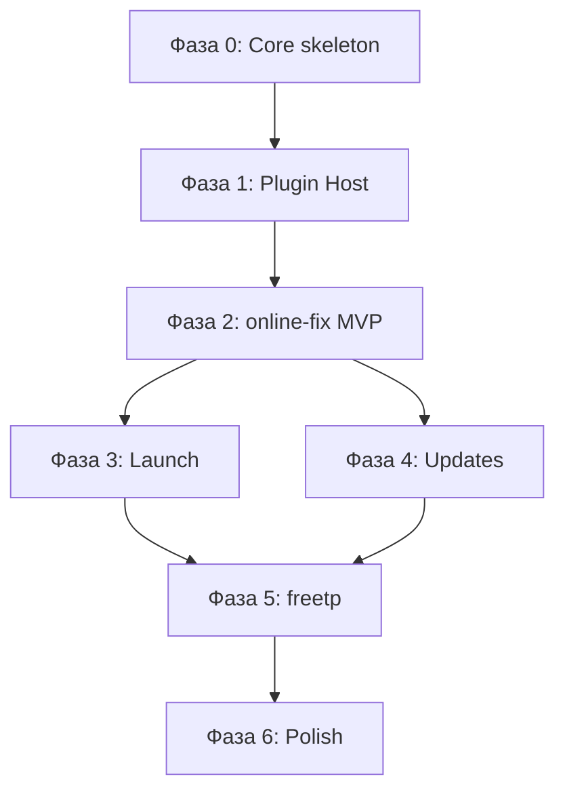

# Arachnel — карта движения (roadmap)

Документ для разработчиков и **будущих AI-агентов**: что уже есть, куда идём, что делать дальше.

Связанные документы:
- [VISION.md](VISION.md) — зачем проект
- [ARCHITECTURE.md](ARCHITECTURE.md) — слои и черновик контракта плагина
- [CATALOG_FORMAT.md](CATALOG_FORMAT.md) — JSON-фид каталога (Hydra/FreeTP + DLC)
- [plugins/README.md](../plugins/README.md) — каталог плагинов

---

## Прогресс (обновлено 2026-07-11)

### Сделано в этой итерации

| Компонент | Статус |
|-----------|--------|
| **Фаза 0.1** SettingsStore | ✅ `~/.local/share/PetWork/Arachnel/settings.json` |
| Дефолтный источник FreeTP | ✅ GitLab URL каталога при первом запуске |
| **Фаза 0.2** LibraryStore | ✅ `library.json`, компоненты/DLC |
| **Фаза 0.3** Убран mock | ✅ Библиотека из store, каталог из JSON-фида |
| **Фаза 0.4** JobOrchestrator | ✅ Очередь torrent-задач, прогресс, отмена |
| **Фаза 0.5** UI настроек путей | ✅ Папки + URL каталога FreeTP |
| **Фаза 1.1** `ISourcePlugin` + типы | ✅ `plugin_interface.h` (черновик) |
| TorrentSession (libtorrent) | ✅ Magnet-загрузка в `downloadsRoot` |
| CatalogFeedLoader | ✅ [freetp-hydra-link](https://gitlab.com/BadKiko/freetp-hydra-link) формат |
| GameMetadataService | ✅ Steam search + appdetails по названию |
| Формат DLC/addons | ✅ `addons[]`, `parentTitle`, `kind` — см. CATALOG_FORMAT |
| Обновления | ✅ Сравнение `uploadDate` игры и DLC |
| UI загрузок | ✅ `DownloadJobCard`, статус каталога, секция дополнений |

### Ещё не сделано

| Компонент | Следующий шаг |
|-----------|---------------|
| PluginHost | Фаза 1.2 — загрузка ячеек |
| Установка после torrent | Плагин freetp: extract/install |
| Запуск игры | ProcessLauncher + launchInfo |
| online-fix плагин | Отдельная ячейка |
| Парсинг Online-Fix сайта | В плагине, не в ядре |

### Уточнение: торрент в ядре

**Загрузка через torrent** — общий транспортный слой ядра (`TorrentSession` + `JobOrchestrator`), потому что FreeTP и будущие источники используют magnet из JSON-фида.

**Установка** (распаковка, installer, fix) — только в плагине-ячейке после завершения загрузки.

---

## Главный принцип: ядро — скелет, плагин — самодостаточная ячейка

```
┌──────────────────────────────────────────────────────────────┐
│  UI (QML)                                                    │
│  библиотека · каталог · детали · настройки                   │
└────────────────────────────┬─────────────────────────────────┘
                             │ Core API (единый фасад)
┌────────────────────────────▼─────────────────────────────────┐
│  CORE (тонкое ядро)                                          │
│  · LibraryStore — что установлено, пути, версии, манифесты   │
│  · JobOrchestrator — очередь, статусы, прогресс, отмена      │
│  · TorrentSession — magnet-загрузка (общий транспорт)        │
│  · CatalogFeedLoader — JSON-фид каталога (Hydra-совместимый) │
│  · GameMetadataService — обложка/описание по названию (Steam)│
│  · PluginHost — загрузка/жизненный цикл плагинов (TODO)      │
│  · SettingsStore — папки, URL каталогов, тема              │
│  · ProcessLauncher — запуск exe по launchInfo от плагина (TODO)│
│                                                              │
│  Ядро НЕ содержит: распаковку, installer/fix, парсинг сайтов │
│  источника, логику установки конкретного формата.           │
└────────────────────────────┬─────────────────────────────────┘
                             │ контракт ISourcePlugin
        ┌────────────────────┼────────────────────┐
        ▼                    ▼                    ▼
┌───────────────┐   ┌───────────────┐   ┌───────────────┐
│ online-fix    │   │ freetp        │   │ …             │
│ (ячейка)      │   │ (ячейка)      │   │               │
│               │   │               │   │               │
│ plugin.json   │   │ plugin.json   │   │ plugin.json   │
│ своя реализация│  │ своя реализация│  │               │
│ свои lib/deps │   │ свои lib/deps │   │ свои lib/deps │
│ catalog       │   │ catalog       │   │ catalog       │
│ download      │   │ download      │   │ download      │
│ install       │   │ install       │   │ install       │
│ update        │   │ update        │   │ update        │
│ launchInfo    │   │ launchInfo    │   │ launchInfo    │
└───────────────┘   └───────────────┘   └───────────────┘
```

### Что делает ядро

| Область | Ответственность ядра |
|---------|----------------------|
| Библиотека | Хранит записи (id, version, uploadDate, installPath, components/DLC). |
| Задачи | Torrent download / update jobs, прогресс, отмена. |
| Торрент | `TorrentSession` — magnet → `downloadsRoot` (общий для источников). |
| Каталог | `CatalogFeedLoader` — JSON с GitLab/CDN; метаданные через Steam API. |
| Плагины | Discovery, маршрутизация install/launch (PluginHost — TODO). |
| Настройки | `libraryRoot`, `downloadsRoot`, URL фида FreeTP. |
| Запуск | `QProcess` по `LaunchInfo` — TODO. |

### Что делает плагин (самодостаточная ячейка)

Каждый плагин — **отдельный модуль** со своим кодом и зависимостями:

- парсинг/API каталога источника (или свой индекс поверх общего фида);
- **установка** после torrent (unzip, 7z, silent installer, overlay fix);
- обновление установленной игры (стратегия после download);
- `launchInfo` для установленной игры.

Скачивание torrent ядро уже делает; плагин получает путь к загруженным файлам и выполняет install.

Ядро вызывает плагин через контракт и **не ветвится** по `if (source == "online-fix")`.

### Целевая структура плагина

```
plugins/
  online-fix/
    plugin.json          # id, name, version, capabilities, entry (C++/Python — TBD)
    CMakeLists.txt       # свои target и зависимости (libarchive, curl, …)
    src/
      online_fix_plugin.cpp
      catalog_provider.cpp
      portable_installer.cpp   # распаковка — только здесь
    README.md            # особенности источника, ограничения
```

Плагин может тянуть **свои** библиотеки через свой `CMakeLists.txt`. Ядро линкуется только с абстрактным интерфейсом `ISourcePlugin`.

---

## Текущее состояние

### Готово

| Компонент | Путь | Статус |
|-----------|------|--------|
| UI Material 3 | `qml/app/`, `qml/settings/`, `qml/theme/` | Работает |
| Core stores | `settings_store`, `library_store` | JSON persistence |
| Torrent + jobs | `torrent_session`, `job_orchestrator` | libtorrent, UI прогресс |
| Каталог FreeTP | `catalog_feed_loader` | JSON с GitLab |
| Метаданные | `game_metadata_service` | Steam API |
| Контракт плагина | `plugin_interface.h` | Черновик |
| DLC в модели | `catalog_types`, `CATALOG_FORMAT.md` | addons + parentTitle |
| Обновления | `checkUpdates()` | uploadDate |
| Документация | `docs/*` | ROADMAP, CATALOG_FORMAT |

### В работе / TODO

| Поведение | Статус |
|-----------|--------|
| PluginHost | Не реализован |
| Установка после download | Ждёт плагин freetp |
| Запуск игры | Mock-сообщение |
| online-fix каталог | Плагин не подключён |

### Правило для AI-агентов

**Не добавлять в `src/core/` логику конкретного источника** (распаковка, парсинг Online-Fix, installer FreeTP). Если задача про установку/каталог источника — она живёт в `plugins/<source-id>/`.

---

## Контракт плагина (целевой, для реализации)

Минимальный C++ интерфейс (имена могут уточняться при реализации):

```cpp
// src/core/plugin_interface.h (создать)

struct LaunchInfo {
    QString executable;
    QString workingDirectory;
    QStringList arguments;
};

struct InstallContext {
    QString entryId;           // id в каталоге плагина
    QString targetPath;        // libraryRoot / appId — от ядра
    QString downloadsPath;     // от ядра
    // колбэки прогресса передаются JobOrchestrator'ом
};

class ISourcePlugin {
public:
    virtual ~ISourcePlugin() = default;

    virtual QString id() const = 0;
    virtual QString name() const = 0;
    virtual QStringList capabilities() const = 0;

    virtual QVector<CatalogEntry> search(const QString& query) = 0;
    virtual std::optional<CatalogEntry> metadata(const QString& entryId) = 0;

    // Плагин выполняет download → prepare → finalize сам.
    // Ядро только ждёт колбэки и по завершении пишет LibraryGame.
    virtual void install(const InstallContext& ctx) = 0;
    virtual void cancelInstall(const QString& jobId) = 0;

    virtual std::optional<QString> detectUpdate(const LibraryGame& local) = 0;
    virtual void update(const InstallContext& ctx, const LibraryGame& local) = 0;

    virtual LaunchInfo launchInfo(const LibraryGame& local) = 0;
};
```

`plugin.json` — манифест для PluginHost (id, name, version, capabilities, путь к модулю).

---

## Фазы разработки

Зависимости: каждая фаза опирается на предыдущую. Не перескакивать.



---

### Фаза 0 — Скелет ядра (без плагинов, без мок-библиотеки)

**Цель:** ядро хранит данные и оркестрирует задачи; не знает про архивы.

| ID | Задача | Файлы | Критерий готовности |
|----|--------|-------|---------------------|
| 0.1 | SettingsStore | `src/core/settings_store.*` | ✅ |
| 0.2 | LibraryStore | `src/core/library_store.*` | ✅ |
| 0.3 | Убрать production-mock | `core_controller.cpp` | ✅ |
| 0.4 | JobOrchestrator | `src/core/job_orchestrator.*` | ✅ torrent |
| 0.5 | UI настроек путей | `qml/settings/SettingsPage.qml` | ✅ |

**Не делать в фазе 0:** распаковку, сеть, парсинг сайтов.

---

### Фаза 1 — Plugin Host и контракт

**Цель:** плагины подключаются как ячейки; ядро делегирует, не имплементирует.

| ID | Задача | Файлы | Критерий готовности |
|----|--------|-------|---------------------|
| 1.1 | `ISourcePlugin` + типы | `src/core/plugin_interface.h` | ✅ черновик |
| 1.2 | PluginHost | `src/core/plugin_host.*` | Загрузка встроенных/динамических плагинов |
| 1.3 | Рефакторинг CoreController | `core_controller.*` | `searchCatalog` → plugin; убрать `mockCatalogFor` |
| 1.4 | Stub-плагин | `plugins/online-fix/` | `plugin.json` + плагин возвращает 2–3 записи из локального JSON |
| 1.5 | CMake: плагин как subproject | `plugins/online-fix/CMakeLists.txt`, корневой `CMakeLists.txt` | Плагин собирается отдельным target, линкуется к host |

**Не делать в фазе 1:** реальный парсинг Online-Fix, скачивание.

---

### Фаза 2 — Первый живой плагин: online-fix (portable only)

**Цель:** end-to-end установка одной игры через плагин-ячейку.

Вся логика — **внутри** `plugins/online-fix/`:

| ID | Задача | Где (плагин) | Критерий |
|----|--------|--------------|----------|
| 2.1 | CatalogProvider | `plugins/online-fix/src/catalog_*` | Реальный список игр (парсинг или JSON-индекс) |
| 2.2 | Downloader | `plugins/online-fix/src/download_*` | Скачивание в `downloadsPath` |
| 2.3 | PortableInstaller | `plugins/online-fix/src/install_*` | Распаковка (7z/unzip — зависимость плагина) |
| 2.4 | install() pipeline | плагин | download → extract → finalize |
| 2.5 | Интеграция с JobOrchestrator | ядро + плагин | Прогресс в UI, запись в LibraryStore по завершении |
| 2.6 | Ошибки и отмена | плагин + ядро | Понятный статус failed/cancelled |

**Milestone M3:** «Установить» в каталоге → файл на диске → игра в библиотеке → перезапуск → игра на месте.

---

### Фаза 3 — Запуск игры

| ID | Задача | Где | Критерий |
|----|--------|-----|----------|
| 3.1 | ProcessLauncher | `src/core/process_launcher.*` | QProcess, cwd, args |
| 3.2 | launchInfo() | плагин | exe и путь для portable |
| 3.3 | launchGame() | `core_controller.cpp` | Реальный запуск, не snackbar |
| 3.4 | lastPlayedAt | LibraryStore | «Недавно играли» на Home |

**Milestone M4:** кнопка «Играть» запускает процесс.

---

### Фаза 4 — Обновления

| ID | Задача | Где | Критерий |
|----|--------|-----|----------|
| 4.1 | detectUpdate() | плагин | Сравнение версий с каталогом |
| 4.2 | checkUpdates() | ядро | Обход LibraryStore, обновление hasUpdate |
| 4.3 | update() | плагин | Стратегия online-fix (полная замена) |
| 4.4 | UI | уже есть | Кнопка «Обновить» запускает update job |

---

### Фаза 5 — Второй плагин: freetp (ветвления внутри ячейки)

FreeTP — **отдельная ячейка** со своими installKind-ветками. Ядро только показывает `installKindLabel`.

| installKind | Реализация | Где |
|-------------|------------|-----|
| `portable_archive` | как online-fix | `plugins/freetp/` |
| `bundled_fix` | готовая сборка | `plugins/freetp/` |
| `installer` | silent install | `plugins/freetp/` |
| `fix_download` | игра + отдельный патч | `plugins/freetp/` |

Порядок внутри freetp: `bundled_fix` → `installer` → `fix_download`.

---

### Фаза 6 — Полировка

| Задача | Приоритет |
|--------|-----------|
| Поиск в каталоге привязать к выбранному источнику (`AppWindow.qml` сейчас шлёт только `online-fix`) | высокий |
| Уведомления о завершении задач | средний |
| Логи ядра и плагинов (отдельный файл на плагин) | средний |
| Динамическая загрузка `.so` плагинов (опционально, после встроенных) | низкий |
| Кэш обложек | низкий |

---

## Вехи (milestones)

| Веха | Фазы | Пользователь видит |
|------|------|-------------------|
| **M1 Persistence** | 0 | Библиотека после перезапуска |
| **M2 Plugins** | 1 | Каталог из плагина, не из C++ mock |
| **M3 First install** | 2 | Реальная установка Online-Fix |
| **M4 Play** | 3 | Работает «Играть» |
| **M5 Update** | 4 | Правдивые бейджи обновлений |
| **M6 Multi-source** | 5 | Online-Fix + FreeTP, разные пайплайны |

---

## Решения, которые нужно принять при реализации

| Вопрос | Рекомендация для старта | Примечание |
|--------|-------------------------|------------|
| Хранилище библиотеки | JSON в `~/.local/share/Arachnel/library.json` | SQLite позже, если вырастет |
| Встроенные vs динамические плагины | Сначала **встроенные C++** subprojects | Проще отладка; `.so` — фаза 6 |
| Язык плагинов | C++ (как ядро) | Python — только если явно запросят |
| Распаковка | В плагине; своя зависимость (libarchive / вызов 7z) | **Не в ядре** |
| Каталог Online-Fix | `CatalogProvider` с pluggable backend (JSON index / HTML parse) | Парсинг хрупкий — предусмотреть замену |

---

## Антипаттерны (не делать)

1. **`src/core/unzip.cpp`** — распаковка в ядре.
2. **`if (sourceId == "online-fix")` в ядре** — ветвление в плагине.
3. **Общая «универсальная установка»** в ядре — у каждого источника свой pipeline в ячейке.
4. **Раздувание CoreController** — выносить Store, JobOrchestrator, PluginHost в отдельные классы.
5. **Новые mock-данные в production path** — только dev-флаг или тесты.

---

## Ближайшие 3 шага (для следующего агента)

1. **Фаза 1.2–1.3:** `PluginHost` + рефакторинг `CoreController` → делегирование в плагин.
2. **Плагин `freetp`:** `install()` после torrent — распаковка/установка в `libraryRoot`.
3. **Фаза 3:** `ProcessLauncher` + `launchInfo()` в плагине freetp.

После этого UI менять минимально — меняется backend под уже существующим `Arachnel.Core` API.

---

## Карта файлов (целевая)

```
src/
  main.cpp
  core/
    core_controller.*       # тонкий фасад для QML
    settings_store.*
    library_store.*
    job_orchestrator.*
    plugin_host.*
    plugin_interface.h
    process_launcher.*
    *_model.*               # уже есть
plugins/
  online-fix/               # ячейка
  freetp/                   # ячейка
qml/                        # уже есть, доработки точечные
docs/
  VISION.md
  ARCHITECTURE.md
  ROADMAP.md                # этот файл
```

---

## Риски

| Риск | Митигация |
|------|-----------|
| Сайты меняют вёрстку | Индекс каталога; версия парсера в плагине |
| Большие архивы, обрыв сети | Докачка в плагине |
| Разная структура portable | `launchInfo()` и эвристики в плагине |
| Раздувание ядра | Code review: «это точно не в плагин?» |
